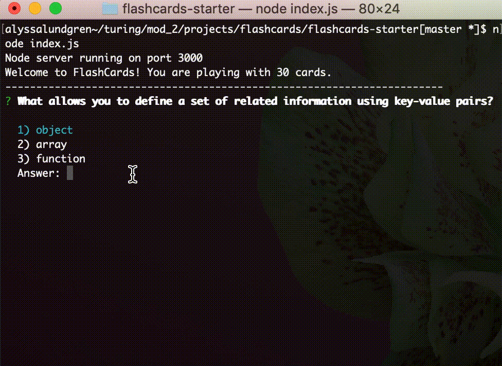

# FlashCards

## About FlashCards

Flashcards, as we all know, played within the terminal. The game, implemented with a full testing suite, utilizes the properties and methods of various Javascript objects as well as array prototype methods. 

## Working Application


## Install & Setup

### Setup
Fork the directory and then clone down the forked repository on your local machine. Change into the cloned directory and install the library dependencies. Run:

```bash
npm install
```

#### Play
From within your root project directory and from the command line input 

```bash
node index.js
```

You should see the following messages:

Node server running on port 3000

Welcome to FlashCards!

From there players navigate answers using the up and down keys and the enter inputs the answer. Feedback on each questions is given as well as a percentage correct at the end. User moves on from the feedback to the next question with the Enter key.  

#### Testing Suite
To begin testing  verify correct setup run npm test in your terminal.

```bash
npm install
```


